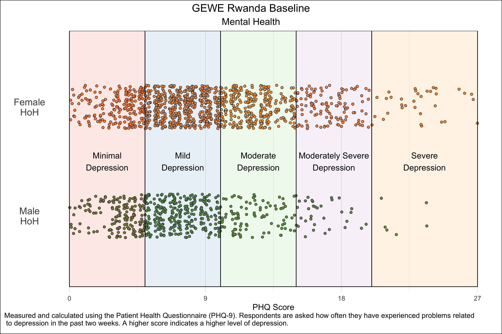
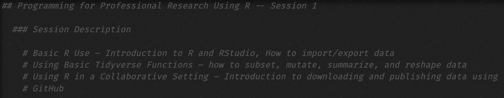
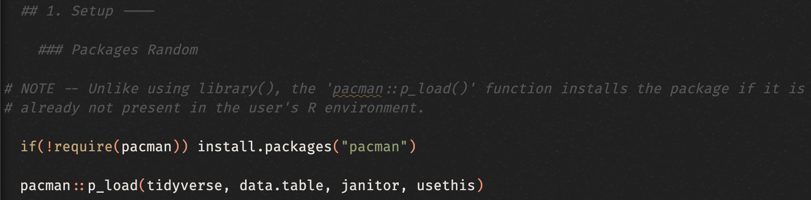

```{r setup, include=FALSE}
options(htmltools.dir.version = FALSE)
library(tidyverse)
library(xaringanExtra)
```

```{r xaringan-themer, include=FALSE, warning=FALSE}
library(xaringanthemer)
style_duo_accent(
  primary_color   = "#000000",
  secondary_color = "#FFFFFF",
  link_color      = "#0645AD",
  text_bold_color = NULL,
  header_font_google = google_font("Atkinson Hyperlegible"),
  text_font_google   = google_font("Atkinson Hyperlegible"),
  code_font_google   = google_font("Fira Mono")
)
```

```{r xaringan-panelset, echo=FALSE}
xaringanExtra::use_panelset()
```

class: center, middle

# Programming for Professional Research Using R

## Session 1

### February 14, 2024

---

## Introduction

.panelset[

.panel[.panel-name[Purpose]

### Purpose of this course: Put you on the right track to use R for professional research.

- **The vast majority** of research assistant/analyst (RA) work consists of cleaning and constructing datasets for analysis

- **Entry-level RA positions rarely require complex econometric/regression skills**

]

.panel[.panel-name[Learning R]

### You should think of learning R like learning a language.

- Taking a six-hour course won't make you proficient in it

- If you don't practice it, you'll forget it

- Solution — **Find ways to use R in your life, either personally or professionally**

]

]

---

## Why R?

.panelset[

.panel[.panel-name[Jobs]

<br>
<br>
<br>
<br>
- Many entry-level research jobs in policy, economic, development, or political science institutions now expect quantitative work using Stata, R, or Python

- Coding skills make you more valuable in any position — data adds value to nearly every kind of research!

]

.panel[.panel-name[Beautiful Tables]

```{r, echo = FALSE, out.width = "100%", fig.align = "center"}


```

]

.panel[.panel-name[Beautiful Graphs]

```{r, echo = FALSE, out.width = "85%", fig.align = "center"}


```

]

.panel[.panel-name[Beautiful Maps]

```{r, echo = FALSE, out.width = "75%", fig.align = "center"}


```

]

]

---

class: middle

## Today

- Learn how to:
  - Think as a coder
  - Identify the basic components of data analysis
  - Set up your environment to use R and RStudio
  - Identify and address basic errors in your R setup
  
- Be introduced to:
  - The R coding language
  - The building blocks of coding in R: scalars, vectors, lists, and data frames

---

class: middle

## Think As A Coder

### Recipe Analogy

.content-box-red[
- Your data are your ingredients
- Your script is your recipe
- Your output is your... cake? Whatever you're making
]

.content-box-blue[
What this means:
- **Make sure you have all of the ingredients you need.**
- **Follow every step of the recipe — you can't skip any steps!**
- If you mess up somewhere, you have to start from scratch to make sure that you get the correct outcome.
]

---

class: middle

## Identify the Basic Components of Data Analysis

.pull-left[
.content-box-red[
<b>Three main components to your data analysis:</b>
- Data
- Code
- Outputs
]
]

.pull-right[
.content-box-blue[
<b>Questions to ask:</b>
- Where is the file stored?
- In which format is the file?
- How easy is it for you/other people to access it?
- Is it intuitive for you to navigate to the file?
]
]

---

## Your RStudio Environment

```{r, echo = FALSE, out.width = "100%", fig.align = "center"}


```

---

## Setting Up Your RStudio Environment

.panelset[

.panel[.panel-name[Setting Up Your Data Structure]

```{r, echo = FALSE, out.width = "55%", fig.align = "center"}


```

.content-box-green[
- Code
- Data
  - Raw Data
  - Intermediate Data
- Outputs
- (Optional) Documentation
- (Optional) Presentations/Slides
]

]

.panel[.panel-name[Setting Up Your Script]

Defining your code's purpose — What are its inputs? What are its outputs?

```{r, echo = FALSE, out.width = "50%", fig.align = "center"}


```

Set up your packages — Which user-created functions do you plan to use?

```{r, echo = FALSE, out.width = "50%", fig.align = "center"}


```

Import your data — Which data frames do you need to fulfill the script's purpose?

```{r, echo = FALSE, out.width = "40%", fig.align = "center"}

knitr::include_graphics(
    "pics/script3.png"
)
```

]

]

---

## R Basics

.panelset[

.panel[.panel-name[Scalars]

This is a scalar:

```{r}
a <- 2
```

It's an object (`a`) with a single value (`2`). Notice that we assign the value `2` to `a` using an arrow `<-`.

]

.panel[.panel-name[Vectors]

These are vectors:

```{r}
vector <- c(1, 2, 5)
vector
```

```{r}
vector <- 2:6
vector
```

```{r}
vector <- seq(2, 3, by = 0.5)
vector
```

Vectors take multiple values. Notice that vectors have a specific **order**: `c(1, 2)` is not the same as `c(2, 1)`.

]

.panel[.panel-name[Selecting Vector Elements]

```{r eval = FALSE}
## By Position

x[4]       # Fourth element

x[-4]      # Everything but the fourth element

x[2:4]     # Elements two to four

x[-(2:4)]  # Everything but elements two to four

x[c(1, 5)] # Elements one and five
```

```{r eval = FALSE}
# By Value

x[x == 10]           # Elements which are equal to 10

x[x < 0]             # Elements that are less than zero

x[x %in% c(1, 2, 5)] # Elements in the set 1, 2, 5
```

]
  
]

---

## R Basics

.panelset[

.panel[.panel-name[Lists]

This is a list:

```{r}
y <- list("a", 1, "b")
```

Lists are different from vectors in one key manner: **they can take objects of different classes**. Vectors can only take objects of the same class.

]

.panel[.panel-name[Some Classes]

Here are some classes in R:

```{r}
a <- "a"    # Character
b <- 1      # Integer
c <- 1.2    # Numeric
d <- 1 + 2i # Complex
e <- TRUE   # Logical
```

]

.panel[.panel-name[Data Frames]

This is a data frame:

```{r}

df <- data.frame(
    first_name = c("Mark", "Mary", "July"),
    last_name  = c("Smith", "John", "Sanchez"),
    age        = c(21, 34, 55)
)

```

At their core, data frames are just a group of named vectors of the same length.
In practice, we visualize data frames as **tables** where each vector is a **column**, or variable, and each group of nth elements of the vectors is a **row**, or observation.

]

.panel[.panel-name[Assignment vs. Printing]

KEY — We can classify the code we write in our script into two general categories:

1. Assignment code. We are **assigning** a value to an object:
```{r}
a <- 2
```

2. Printing code. We are **printing** an object's value:
```{r}
a
```


```{r}
print(a)
```

**Only 2. results in something appearing in your console. When you assign a value to an object, nothing prints in the console.**

]

]

---

## R Basics

NOTE — R works in a manner that allows to write a specific function over multiple lines. This is called a **code chunk**.

This:
```{r}
a <- mean(c(seq(1, 4, by = 0.5)))

a
```

Is the same as this:
```{r}
a <- mean(
    c(
        seq(1, 4, by = 0.5)
    )
)

a

```

---

## R Basics

You can click anywhere in the code chunk and click "run" or Cmd+Enter (Mac)/Ctrl+Enter (Windows), and the whole chunk will run.

KEY — If you only select a portion of the code chunk and run that, then R will identify the chunk as unfinished and refuse to let you do anything else until you've "completed" it.

---

class: center, middle

# Coding Set Up

---

.panelset[

.panel[.panel-name[Installing Packages]

Packages are groups of user-created functions that help us accomplish tasks that would be harder/impossible using base R functions.

### Easy

```{r eval = FALSE}
install.packages("tidyverse")
library(tidyverse)
```

### Better

The `pacman` package installs packages if they aren't installed yet, loads them otherwise

```{r eval = FALSE}
if(!require(pacman)) install.packages("pacman")
pacman::p_load(tidyverse)
```

]

.panel[.panel-name[Setting up File Paths]

File paths help R identify where the files you want to use are located.

You want your code to be **reproducible** and **easy to use by other people**

Simple solution: Create an `.rproj` file that people can open to access your R environment

Better solution:

```{r eval = FALSE}
# Set User (this allows us to use fixed file paths but to adapt them
# for multiple possible users)
  
      # 1 — Marc-Andrea Fiorina
  
      # 2 — Enter here if needed
  
user <- 1
  
if(user == 1) {
    # Absolute file path
    main_filepath <- "/Users/marc-andreafiorina/Dropbox/SAIS R Course/"
}

# Notice the relative file paths

data_filepath <- paste0(main_filepath, "data/")
```

]

]

---

class: center, middle

# Importing Data

---

class: middle

Easiest file type to import into R is a .csv file. But you can also import .xlsx, .dta (Stata), etc.

- Easy `->` `read.csv()`
- Harder (faster) `->` `data.table::fread()`

```{r eval = FALSE}
norms_values_data <- data.table::fread(
    "raw/wvs_values_norms_data.csv",
    na.strings = ""
)
```

---

## Basic Issues in RStudio
### Data Not Loading

```{r, echo = FALSE, out.width = "90%", fig.align = "center"}


```


```{r, echo = FALSE, out.width = "90%", fig.align = "center"}

knitr::include_graphics(
    "pics/data_not_loading2.png"
)
```

---

## Basic Issues in RStudio
### Data Not Loading

Check:
- Working directory — `getwd()` or check the top of the RStudio console.
- File path — are there any typos? Is your file where you expect it to be?

Solutions:
- If you were provided with an `.Rproj` file alongside your script, make sure that you opened the project.
- Modify the working directory using `setwd()` or correct the file path if need be!

---

## Basic Issues in RStudio
### Function Not Found

```{r, echo = FALSE, out.width = "100%", fig.align = "center"}


```

---

## Basic Issues in RStudio
### Function Not Found

Check:
- From which package the function comes. You can do this using `??FUNCTION NAME` (e.g. `??tabyl`) or through a Google search.
- That the package is (1) installed in your environment and (2) loaded. Having the package installed isn't sufficient!

Solutions:
- If the package isn't installed, use `install.packages("tabyl")`. If the package isn't loaded, use `library(tabyl)` or `pacman::p_load(tabyl)`.

---

## Basic Issues in RStudio
### Code Not Running

```{r, echo = FALSE, out.width = "100%", fig.align = "center"}


```

---

## Basic Issues in RStudio
### Code Not Running

Check:
- That you didn't miss a parenthesis (`)`) or bracket (`}`) in your code! This is the most common reason.
- If you missed it, the console will show a `+` at the start of the console line instead of the expected `>`.

Solutions:
- Type gibberish and/or the missing parenthesis/bracket until the `>` reappears. More likely, you'll have to rerun the code chunk to make sure it works!

---

## Basic Issues in RStudio
### Object Not Found

```{r, echo = FALSE, out.width = "100%", fig.align = "center"}


```

---

## Basic Issues in RStudio
### Object Not Found

Check:
- Whether the object exists in your environment. More likely than not, you either misspelt the name of the object, or you skipped the code that creates it (remember that a script is like a recipe and steps can't be skipped!).

Solutions:
- Backtrack in your code and run the chunk that creates the object.
- If a typo is at fault, correct the typo.

---

class: center, middle

## Practical Exercise — Using the World Values Survey Dataset

---
<font size='+3'><b>World Values Survey</b></font>

<font size='+2'><b>Background</b></font>
<br> <br>
*"The survey, which started in 1981, seeks to use the most rigorous, high-quality research designs in each country. The WVS consists of nationally representative surveys conducted in almost 100 countries which contain almost 90 percent of the world’s population, using a common questionnaire. [...] WVS seeks to help scientists and policy makers understand changes in the beliefs, values and motivations of people throughout the world."*

<font size='+2'><b>Survey Contents</b></font>
.pull-left[
- Social values, attitudes & stereotypes
- Societal well-being
- Social capital, trust and organizational membership
- Economic values
- Corruption
- Migration
- Post-materialist index
]

.pull-right[
- Science & technology
- Religious values
- Security
- Ethical values & norms
- Political interest and political participation
- Political culture and political regimes
- Demography
]

---

### Today's practical component

1— Download the World Values Survey (Wave 7) at this link: [https://www.worldvaluessurvey.org/WVSDocumentationWV7.jsp](https://www.worldvaluessurvey.org/WVSDocumentationWV7.jsp)

2— Set up your data analysis folder. Make sure that it has the following components:
  - Data
      - Raw
      - Intermediate
  - Code
  - Outputs
  - Documentation
    
3— Place the data and documentation files that you find appropriate for your analysis in the corresponding folders.

4— Open RStudio and click on "New Project" in the "File" dropdown menu. Navigate to your data folder and select it.

---

### Today's practical component

5— Set up your R Script. It should have the following components:
  - Package setup. For now, have the script load the `dplyr`, `data.table`, and `janitor` packages.
  - Data import. Import your data into the script using `read.csv()` or `fread()`. Remember to give your data frame an intuitive name!
    
6— Test your R Script. Type and run the following line in your code: `[[DATASETNAME]] %>% head()`. If this works without issue, you're free to go!

---

## Links

Syllabus: **https://mfiorina.github.io/sais_r_course/syllabus/r_course_syllabus.html**

Thomas Mock, “A Gentle Introduction to Tidy Statistics in R” (**[blog post](https://themockup.blog/posts/2018-12-10-a-gentle-guide-to-tidy-statistics-in-r/)** and **[video](https://www.rstudio.com/resources/webinars/a-gentle-introduction-to-tidy-statistics-in-r/)**)

Hadley Wickham & Garrett Grolemund, **[R for Data Science](https://r4ds.had.co.nz/)**

RStudio, **[RStudio Cheatsheets](https://www.rstudio.com/resources/cheatsheets/)**

