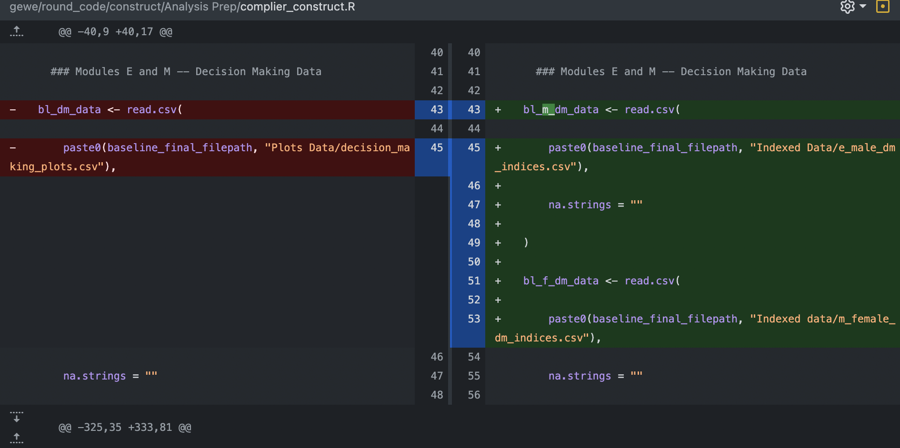

```{r setup, include=FALSE}
options(htmltools.dir.version = FALSE)
library(tidyverse)
library(xaringanExtra)
```

```{r xaringan-themer, include=FALSE, warning=FALSE}
library(xaringanthemer)
style_duo_accent(
  primary_color   = "#000000",
  secondary_color = "#FFFFFF",
  link_color      = "#0645AD",
  text_bold_color = NULL,
  header_font_google = google_font("Atkinson Hyperlegible"),
  text_font_google   = google_font("Atkinson Hyperlegible"),
  code_font_google   = google_font("Fira Code"),
  code_font_size     = "0.8rem"
)
```

```{r xaringan-panelset, echo=FALSE}
xaringanExtra::use_panelset()
```

class: center, middle

# Programming for Professional Research Using R

## Session 2

### February 21, 2024

---

class: middle

## Setting Up

- Open RStudio.
- Type in the following lines, <font color = "red"><b>replacing "YOURFILEPATHHERE" with a file path where these files will be saved</b></font>.
    - For MacBook users, this could be "/Users/marc-andreafiorina/Desktop/"
    - For Windows users, this could be "C:/Users/marc-andreafiorina/Desktop/"

```{r eval = FALSE}

install.packages("usethis")
library(usethis)
usethis::use_course(
    "https://github.com/mfiorina/sais_r_course/archive/main.zip",
    destdir = "YOURFILEPATHHERE"
)

```

---

class: middle

## Today

- Learn how to:
  - Filter, mutate, group, and summarize data using Tidyverse functions
  - Reshape data using Tidyverse functions
      
- Be introduced to:
  - Code and data collaboration -- GitHub and data project reproducibility

- Practice the above!

---

class: center, middle

# Data 'Wrangling'

---

### Tidyverse Introduction

.panelset[

.panel[.panel-name[Base R Layout]

```{r}
names(mtcars)
```

```{r}
str_replace(str_to_upper(names(mtcars)), "MPG", "HELLO")
```

]

.panel[.panel-name[Tidyverse Layout]

Tidyverse functions introduce a 'cleaner' method to write code out, using what is called the 'pipe operator': **`%>%`**. It's almost like writing a recipe, step by step.

```{r}
names(mtcars)
```

```{r}
mtcars %>%
    names() %>%
    str_to_upper() %>%
    str_replace("MPG", "HELLO")
```

]

]

---

### Basic Wrangling Functions

.panelset[

.panel[.panel-name[mutate()]

```{r}
mutate_example <- mtcars %>%
    mutate(
        heavy = case_when(
            wt > 3 ~ "Yes",
            TRUE   ~ "No"
        )
    ) %>%
    select(wt, heavy)

mutate_example %>% head()
```

]

.panel[.panel-name[filter()]

```{r}
filter_example <- mtcars %>%
    filter(wt > 3)

filter_example %>% head()
```

]

.panel[.panel-name[select()]

```{r}
select_example <- mtcars %>%
    select(
        matches("mpg|carb")
    )
select_example %>% head()
```

]

]

---

### Basic Wrangling Functions

.panelset[

.panel[.panel-name[group_by() and summarize()]

```{r}
group_by_summarize_example <- mtcars %>%
    group_by(cyl) %>%
    summarize(
        mpg = mean(mpg, na.rm = TRUE)
    )

group_by_summarize_example
```

]

.panel[.panel-name[pivot_longer()]

```{r}
relig_income[1:6] %>% head(n = 2)
relig_income_long <- relig_income %>%
    pivot_longer(
        cols      = !religion, # Everything but religion
        names_to  = "levels",
        values_to = "num"
    )
relig_income_long %>% head(n = 2)
```

]

.panel[.panel-name[pivot_wider()]

```{r}
fish_encounters %>% head(n = 2)
fish_encounters_wide <- fish_encounters %>%
    pivot_wider(
        names_from  = station,
        values_from = seen
    )
fish_encounters_wide[1:6] %>% head(n = 2)
```

]

]

---

### Functions in R

What is a function?

```{r}
z_score <- function(vector) {
    (vector - mean(vector)) / sd(vector)
}
z_score(seq(0, 10))
```

A function allows you to efficiently save an operation you may have to use repeatedly, and to run it while only having to modify its inputs, or **arguments**.

```{r}
# I want to find the z score of the following vectors: c(1, 3, 5) and
# seq(20, 40). I could do the following:
(c(1, 3, 5) - mean(c(1, 3, 5))) / sd(c(1, 3, 5))
(seq(10, 20) - mean(seq(10, 20))) / sd(seq(10, 20))
```

---

### Functions in R

```{r}
# Easier is this:
z_score(c(1, 3, 5))
z_score(seq(10, 20))
```

---

### Iterative Functions in R

What if I want to apply the same function to multiple objects?

What if I wanted to apply the `z_score()` function to 30 variables in my dataset? Rewriting it would be inefficient...

The solution: the function `map()` from the package `purrr`.

```{r}
library(purrr)
purrr::map(
    .x = list(
        c(1, 3, 5), seq(10, 20)
    ),
    .f = z_score
)
```

---

### Iterative Functions in R

Notice that the previous chunk's output is a list. If you want to output a different class of object, `purrr` has the functions `map_chr()`, `map_dbl()`, and `map_df()` amongst others.

`map()` has a shorthand to simplify its use: instead of writing the function out, you can replace `function() {}` with `~` and the function's argument with `.x`.

.pull-left[
```{r, warning = FALSE}
map_chr(
    c(1, 3, 5),
    function(x) {
        x + 10
    }
)
```
]
.pull-right[
```{r, warning = FALSE}
map_chr(
    c(1, 3, 5),
    ~ .x + 10
)
```
]

---

### Iterative Functions in R

We can also apply `map()` to a data frame. If we do so, `map()` will apply the same function to every component of the data frame, i.e. its **columns**. In practice, this is equivalent to applying `map()` to a list of vectors.

```{r, warning = FALSE}
library(palmerpenguins) # A fun practice dataset about penguins!
# I want to know the class of every variable in the palmerpenguins data frame.
data(package = 'palmerpenguins')

# Let's take a glimpse at the dataset:
penguins %>% head(n = 2)

penguins %>% map_chr(~ class(.x))
```

---

### Iterative Functions in R

Beyond the scope of this class: sometimes we want to iterate functions that have more than one argument.

To do so, `purrr` provides the following functions: `map2()` (two arguments) and `pmap()` (unlimited arguments)

```{r, warning = FALSE}

animals <- c("tiger", "elephant", "giraffe")
colors <- c("red", "orange", "blue")

map2( # paste0() concatenates its arguments into a single string
    animals, colors, ~ paste0("The ", .x, " is ", .y, ".")
)

```

For more on iterative functions, I strongly recommend [this blog post by Rebecca Barter](https://www.rebeccabarter.com/blog/2019-08-19_purrr).

---

class: center, middle

# Code and Data Collaboration

## Important Points

---

class: middle

## Professional settings are collaborative settings

Most R courses teach you to code in isolation. But **professional use of R often happens within teams of researchers**.

Reproducibility and shareability of your code are key to ensure:
- Others can use and understand your work
- Accountability

---

## The ultimate collaborative tool: GitHub

GitHub is the preferred code storing platform for data teams because of the following attributes:
- **Easy sharing** of scripts between team members
- **Tracked changes** — every changed line of code is attributed to a specific person
- **'Commit' structure** — allows you to see how your changes affect other people's work on the same scripts

```{r, echo = FALSE, out.width = "75%", fig.align = "center"}


```

---

class: center, middle

## Practical Exercise — Using the World Values Survey Dataset

---

<font size='+3'><b>World Values Survey</b></font>

<font size='+2'><b>Background</b></font>
<br> <br>
*"The survey, which started in 1981, seeks to use the most rigorous, high-quality research designs in each country. The WVS consists of nationally representative surveys conducted in almost 100 countries which contain almost 90 percent of the world’s population, using a common questionnaire. [...] WVS seeks to help scientists and policy makers understand changes in the beliefs, values and motivations of people throughout the world."*

<font size='+2'><b>Survey Contents</b></font>
.pull-left[
- Social values, attitudes & stereotypes
- Societal well-being
- Social capital, trust and organizational membership
- Economic values
- Corruption
- Migration
- Post-materialist index
]

.pull-right[
- Science & technology
- Religious values
- Security
- Ethical values & norms
- Political interest and political participation
- Political culture and political regimes
- Demography
]

---

class: middle

### Today's practical component

1. Successfully run the code in the `session_1_template.R` script

2. Create your own script and do one or more of the following:
  
    - Find mean values for 'importance in life' variables (Q1-6) for countries in another region than Europe
  
    - Calculate average 'enthusiasm' for these life subjects in countries in another region than Europe
  
    - Perform the same analysis, either on European countries or other countries, for another group of indicators in the dataset:
        - Important child qualities: Q7-18
        - Neighbors: Q19-26
        - Statements to agree with: Q27-41
        
3. Attempt the bonus section on `map()` if you're done!
    
**NOTE** — You should refer to documentation for the dataset, which can be found in `Dropbox/SAIS R Course/documentation/`, for details on the variables and their given values.

---

## Links

Syllabus: **https://mfiorina.github.io/sais_r_course/syllabus/r_course_syllabus.html**

Thomas Mock, “A Gentle Introduction to Tidy Statistics in R” (**[blog post](https://themockup.blog/posts/2018-12-10-a-gentle-guide-to-tidy-statistics-in-r/)** and **[video](https://www.rstudio.com/resources/webinars/a-gentle-introduction-to-tidy-statistics-in-r/)**)

Dominic Royé, **[“A very short introduction to Tidyverse”](https://dominicroye.github.io/en/2020/a-very-short-introduction-to-tidyverse/)**

tidyr, **[“Pivoting”](https://tidyr.tidyverse.org/articles/pivot.html)**

Rebecca Barter, **["Learn to purrr"](https://www.rebeccabarter.com/blog/2019-08-19_purrr)**

Hadley Wickham, **[“dplyr 1.0.0: working across columns”](https://www.tidyverse.org/blog/2020/04/dplyr-1-0-0-colwise/)**

Hadley Wickham & Garrett Grolemund, **[R for Data Science](https://r4ds.had.co.nz/)**

RStudio, **[RStudio Cheatsheets](https://www.rstudio.com/resources/cheatsheets/)**

