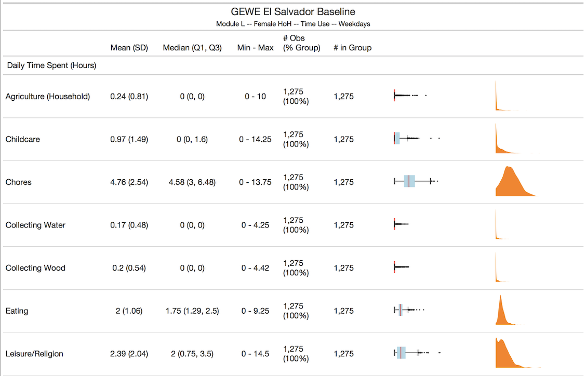

```{r setup, include=FALSE}
options(htmltools.dir.version = FALSE)
library(tidyverse)
library(xaringanExtra)
```

```{r xaringan-themer, include=FALSE, warning=FALSE}
library(xaringanthemer)
style_duo_accent(
  primary_color   = "#000000",
  secondary_color = "#FFFFFF",
  link_color      = "#0645AD",
  header_font_google = google_font("Atkinson Hyperlegible"),
  text_font_google   = google_font("Atkinson Hyperlegible"),
  code_font_google   = google_font("Fira Code"),
  code_inline_background_color = "#e7e8e1",
  text_bold_color = NULL
)
```

```{r xaringan-panelset, echo=FALSE}
xaringanExtra::use_panelset()
```

class: center, middle

# Programming for Professional Research Using R

## Session 2

### October 9, 2025

---

class: middle

## Today

- Learn how to:
      - Create a scatter plot, density plot, and bar chart using the `ggplot2` package
      - Create flexible and easy-to-read tables of any dataset using the `gt` package
      - Create simple academic-standard regression output tables using the `stargazer` package

- Practice the above!

---

class: center, middle

## Data Visualization — Descriptive Statistics — Plots

---

## Descriptive Stats Plots

`ggplot2` is the gold standard in data visualization in data work. It's one of the main reason that people use R over other programming languages.

Very simple syntax and allows you to add elements very easily.

You can use `ggplot2` to create any type of plot you can think of.

I've included a lot of links at the end of these slides to explore the possibilities of `ggplot2` further. Strongly recommend you use them or at least save them somewhere.

```{r, echo = FALSE, out.width = "60%", fig.align = "center"}


```

---

### The Magic of `ggplot2`

Using `ggplot2` to create plots is great because the **structure** it sets up makes plot creation intuitive.

.pull-left-wide[
``` {r, eval = FALSE}
ggplot(data = <DATA>) +
  <GEOM_FUNCTION>(
     mapping = aes(<MAPPINGS>),
     stat = <STAT>,
     position = <POSITION>
  ) +
  <SCALE_FUNCTION> +
  <FACET_FUNCTION> +
  <THEME_FUNCTION>
```
]

.pull-right-wide[
1. `Data`: The data that you want to visualize
2. `Layers`: geom\_ and stat\_ → The geometric shapes and statistical summaries representing the data
3. `Aesthetics`: aes() → Aesthetic mappings of the geometric and statistical objects
4. `Scales`: scale_ → Maps between the data and the aesthetic dimensions
5. `Facets`: facet_ → The arrangement of the data into a grid of plots
6. `Visual themes`: theme() and theme_ → The overall visual defaults of a plot
]

---

### Scatter Plot — Step-by-Step

.panelset[

.panel[.panel-name[Dataset]

Start with a dataset you want to visualize

```{r}
head(mtcars)
```

]

.panel[.panel-name[Convert to Plot]

.pull-left-wide[

```{r, eval = FALSE}
ggplot(mtcars)

```

]

.pull-right-wide[

```{r, fig.align = "center", echo = FALSE}
ggplot(mtcars)

```

]

]

.panel[.panel-name[Add Something]

.pull-left-wide[

```{r, eval = FALSE}
ggplot(mtcars) +
  geom_point(
    aes(x = mpg, y = wt)
  )
```

]

.pull-right-wide[

```{r, fig.align = "center", echo = FALSE}
ggplot(mtcars) +
  geom_point(
    aes(x = mpg, y = wt)
  )
```

]

]

]

---

### Scatter Plot — Make It Better

.pull-left-wide[

```{r, eval = FALSE}
ggplot(mtcars) +
  geom_point(
    aes(
      x = mpg, y = wt,
      color = factor(cyl)
    ),
    size = 6
  ) +
  xlab("Miles/Gallon") +
  ylab("Weight") +
  scale_color_discrete(
    name = "# of Cylinders"
  ) +
  theme_minimal(base_size = 24) +
  theme(
    legend.position = "bottom"
  )
```

]

.pull-right-wide[

```{r, fig.align = "center", echo = FALSE}
ggplot(mtcars) +
  geom_point(
    aes(
      x = mpg, y = wt,
      color = factor(cyl)
    ),
    size = 6
  ) +
  xlab("Miles/Gallon") +
  ylab("Weight") +
  scale_color_discrete(name = "# of Cylinders") +
  theme_minimal(base_size = 24) +
  theme(
    legend.position = "bottom"
  )
```

]

---

### Bar Plot — Step-by-Step

.panelset[

.panel[.panel-name[Dataset]

Start with a dataset you want to visualize

```{r, include = FALSE}
mtcars_summary <- mtcars %>%
  group_by(cyl) %>%
  summarize(
    mpg = mean(mpg)
  ) %>%
  ungroup()

```

```{r}
mtcars_summary
```

]

.panel[.panel-name[Convert to Plot]

.pull-left-wide[

```{r, eval = FALSE}
ggplot(mtcars_summary)

```

]

.pull-right-wide[

```{r, fig.align = "center", echo = FALSE}
ggplot(mtcars_summary)

```

]

]

.panel[.panel-name[Add Something]

.pull-left-wide[

```{r, eval = FALSE}
ggplot(mtcars_summary) +
  geom_col(
    aes(
      x = cyl,
      y = mpg
    )
  )
```

]

.pull-right-wide[

```{r, fig.align = "center", echo = FALSE}
ggplot(mtcars_summary) +
  geom_col(
    aes(
      x = cyl,
      y = mpg
    )
  )
```

]

]

.panel[.panel-name[Fix Class Issue]

.pull-left-wide[

```{r, eval = FALSE}
ggplot(mtcars_summary) +
  geom_col(
    aes(
      x = factor(cyl),
      y = mpg
    )
  )
```

`cyl` categorizes cars by number of cylinders. Although the values are numbers, it is a **categorical** variable. We communicate this to `ggplot()` using the `factor()` function.

]

.pull-right-wide[

```{r, fig.align = "center", echo = FALSE}
ggplot(mtcars_summary) +
    geom_col(
        aes(
            x = factor(cyl), y = mpg)
    )
```

]

]

]

---

### Bar Plot — Make It Better

.pull-left-wide[

```{r, eval = FALSE}
ggplot(mtcars_summary) +
  geom_col(
    aes(
      x    = factor(cyl),
      y    = mpg,
      fill = factor(cyl)
    )
  ) +
  xlab("# of Cylinders") +
  ylab("Miles/Gallon") +
  scale_y_continuous(
      limits = c(0, 30)
  ) +
  theme_minimal(base_size = 24) +
  theme(
    legend.position = "none"
  )
```

]

.pull-right-wide[

```{r, fig.align = "center", echo = FALSE}
ggplot(mtcars_summary) +
  geom_col(
    aes(
      x    = factor(cyl),
      y    = mpg,
      fill = factor(cyl)
    )
  ) +
  xlab("# of Cylinders") +
  ylab("Miles/Gallon") +
  scale_y_continuous(
      limits = c(0, 30)
  ) +
  theme_minimal(base_size = 24) +
  theme(
    legend.position = "none"
  )
```

]

---

class: middle
name: plot-standards

## Plot Standards

.content-box-blue[
1. Your plot should be <font color = "red">**properly labeled**</font>:
    - The plot should have a title describing its content
    - Axes should be labeled
    - Legend (if any) should have a title and labels
    
2. Your plot should be <font color = "red">**properly formatted**</font>:
    - Axis dimensions should be appropriate. What is appropriate varies depending on context, but usually you should aim to fill the plot space with data
    - Text size should be large enough for text to be legible
    
3. Your plot should be <font color = "red">**self contained**</font>. People should be able to understand your plot and its data without any other context or explanatory text. That means:
    - A caption note that includes data source and any important data construction notes
    - Title and subtitle that deliver the plot's *message*
]

---

class: center, middle

## Data Visualization — Descriptive Statistics — Tables

---

## Descriptive Statistics Tables

Thankfully, not every RA position requires academic-standard tables or use of LateX.

It is still useful, however, to be able to communicate descriptive statistics about data.

There are countless R packages to help do this. Today, we're looking at the `gt` package. It's simple to use and it's very easy to create good-looking tables using it.

`gt` exports into .png, .pdf, or .html. You can add interactive elements, plots within columns.

```{r, echo = FALSE, out.width = "50%", fig.align = "center"}


```

---

### Descriptive Statistics Table — Step-by-Step

We will mainly use the example in the script for this. To summarize, the steps are:

- Create a dataset you want to export

- Run the dataset through the `gt()` function to create a gt object

- Customize the table using functions from the `gt` package (see online for further things you can do). Examples of what you can do include:
    - Modify column names — `cols_label()`
    - Modify borders — `tab_style()`, `cell_borders()`
    - Add colors conditional on cell value — `data_color()`
    - Add title/subtitle — `tab_header()`

- Export the table using `gtsave()`

---

class: middle, center

## Data Visualization — Simple Regression Table

---

### Regression Tables

Regression tables are very common in economic/policy analysis.

They're very simple to create using R and a software called **LateX** (pronounced latek).

Unless you're getting into academic research, you don't need to know how to properly use LateX. Just enough to:

- Export the LateX script from R
- Copy/paste it into a LateX-reading software, e.g. Overleaf
- Export the pdf or png to share

```{r, echo = FALSE, out.width = "50%", fig.align = "center"}
magick::image_read_pdf("pics/reg_table_example.pdf",
                       pages = 1)
```

---

### Regression Table — Step by Step

.panelset[

.panel[.panel-name[Run Regression in R]

```{r eval = FALSE}

# Simplest regression format in R

reg_example <- lm(
    outcome_variable ~ independent_variable + control_variables,
    data = dataset
)

# Observe results

summary(reg_example)

```

]

.panel[.panel-name[Convert to Exportable Table]

Simply do one of these!

```{r eval = FALSE}

reg_example_ht <- huxtable::huxreg(reg_example)

```

OR

```{r eval = FALSE}

reg_example_sg <- stargazer::stargazer(reg_example)
# Many options to make prettier

```

]

]

---

### Regression Table — Step by Step

.panelset[

.panel[.panel-name[Export Huxtable Table]

Some simple options for the Huxtable table:

```{r eval = FALSE}
  
  huxtable::quick_latex(
      reg_example_ht,
      file = "filepath/filepath/filepath/reg_example_ht.tex"
  )
  
  huxtable::quick_pdf
      reg_example_ht,
      file = "filepath/filepath/filepath/reg_example_ht.pdf"
  )
  
  huxtable::quick_html(
      reg_example_ht,
      file = "filepath/filepath/filepath/reg_example_ht.html"
  )
  
```

]

.panel[.panel-name[Export Stargazer Table]

```{r eval = FALSE}

# You can export a LateX script using the 'writeLines' function

writeLines(
    reg_example_sg,
    "filepath/filepath/filepath/reg_example_sg.tex"
)

```

To visualize your table, the easiest solution is to:

- Create a free Overleaf account on [overleaf.com](https://www.overleaf.com)
- Open a new document
- Copy/paste your .tex output in between the `begin{document}` and `end{document}` lines
- Click compile and then save!

You can also install the `tinytex` package and use `pdftolatex` to save a PDF file.

]

]

---

class: center, middle

## Practical Exercise — Using the World Values Survey Dataset

---
<font size='+3'><b>World Values Survey</b></font>

<font size='+2'><b>Background</b></font>
<br> <br>
*"The survey, which started in 1981, seeks to use the most rigorous, high-quality research designs in each country. The WVS consists of nationally representative surveys conducted in almost 100 countries which contain almost 90 percent of the world’s population, using a common questionnaire. [...] WVS seeks to help scientists and policy makers understand changes in the beliefs, values and motivations of people throughout the world."*

<font size='+2'><b>Survey Contents</b></font>
.pull-left[
- Social values, attitudes & stereotypes
- Societal well-being
- Social capital, trust and organizational membership
- Economic values
- Corruption
- Migration
- Post-materialist index
]

.pull-right[
- Science & technology
- Religious values
- Security
- Ethical values & norms
- Political interest and political participation
- Political culture and political regimes
- Demography
]

---

### Today's practical component

1. Download the required data for this session from [this Dropbox folder](https://www.dropbox.com/scl/fo/6m5hzlrc82i04oi0qoam7/h?rlkey=ctf6b0stve3vgbck9ka7mj5ia&st=x9y9ce88&dl=0)

2. Successfully run the code in the `session_2.R` script

3. Attempt the challenges at the bottom of the script!

---

class: middle

## Links

<ins>**Tables**</ins>

Marek Hlavac, **[“stargazer: beautiful LATEX, HTML and ASCII tables from R statistical output”](https://cran.rproject.org/web/packages/stargazer/vignettes/stargazer.pdf)**

Thomas Mock, **[“gt - a (G)rammar of (T)ables”](https://themockup.blog/posts/2020-05-16-gt-a-grammer-of-tables/)**

<ins>**Plots**</ins>

Alicia Horsch, **[“A quick introduction to ggplot2”](https://towardsdatascience.com/a-quick-introduction-to-ggplot2-d406f83bb9c9)**

RStudio, **[RStudio Cheatsheets](https://www.rstudio.com/resources/cheatsheets/)**

