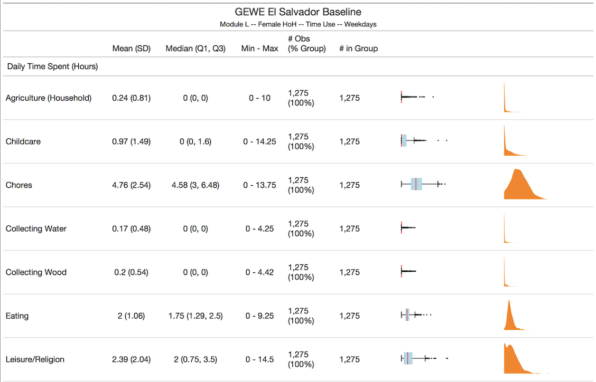
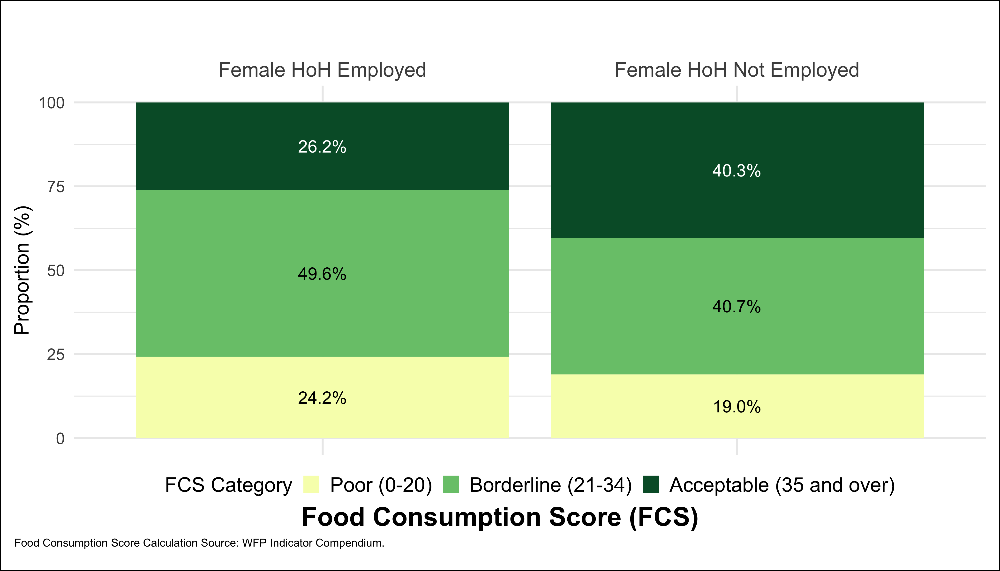

```{r setup, include=FALSE}
options(htmltools.dir.version = FALSE)
library(tidyverse)
library(xaringanExtra)
```

```{r xaringan-themer, include=FALSE, warning=FALSE}
library(xaringanthemer)
style_duo_accent(
  primary_color   = "#000000",
  secondary_color = "#FFFFFF",
  link_color      = "#0645AD",
  header_font_google = google_font("Atkinson Hyperlegible"),
  text_font_google   = google_font("Atkinson Hyperlegible"),
  code_font_google   = google_font("Fira Code"),
  text_bold_color = NULL
)
```

```{r xaringan-panelset, echo=FALSE}
xaringanExtra::use_panelset()
```

class: center, middle

# Programming for Professional Research Using R

## Session 4

### March 6, 2024

---

class: middle

## Today

- Pop quiz

- Learn how to:
      - Create simple academic-standard regression output tables using the `stargazer` package
      - Create flexible and easy-to-read tables of any dataset using the `gt` package
      - Create a scatter plot, density plot, and bar chart using the `ggplot2` package

- Practice the above!

---

class: middle, center

## Pop Quiz!

## [https://pollev.com/marcandreafiorina503](https://pollev.com/marcandreafiorina503)

---

class: middle
## Pop Quiz 'Tidy' Question

```
table_a
#> # A tibble: 6 x 3
#>   country      year rate             
#> * <chr>       <int> <chr>            
#> 1 Afghanistan  1999 745/19987071     
#> 2 Afghanistan  2000 2666/20595360    
#> 3 Brazil       1999 37737/172006362  
#> 4 Brazil       2000 80488/174504898  
#> 5 China        1999 212258/1272915272
#> 6 China        2000 213766/1280428583

table_b
#> # A tibble: 12 x 4
#>   country      year type           count
#>   <chr>       <int> <chr>          <int>
#> 1 Afghanistan  1999 cases            745
#> 2 Afghanistan  1999 population  19987071
#> 3 Afghanistan  2000 cases           2666
#> 4 Afghanistan  2000 population  20595360
#> 5 Brazil       1999 cases          37737
#> 6 Brazil       1999 population 172006362
#> # … with 6 more rows
```

---

class: middle
```
table_c
#> # A tibble: 6 x 4
#>   country      year  cases population
#>   <chr>       <int>  <int>      <int>
#> 1 Afghanistan  1999    745   19987071
#> 2 Afghanistan  2000   2666   20595360
#> 3 Brazil       1999  37737  172006362
#> 4 Brazil       2000  80488  174504898
#> 5 China        1999 212258 1272915272
#> 6 China        2000 213766 1280428583

# Spread across two tibbles
table_d1  # cases
#> # A tibble: 3 x 3
#>   country     `1999` `2000`
#> * <chr>        <int>  <int>
#> 1 Afghanistan    745   2666
#> 2 Brazil       37737  80488
#> 3 China       212258 213766
table_d2  # population
#> # A tibble: 3 x 3
#>   country         `1999`     `2000`
#> * <chr>            <int>      <int>
#> 1 Afghanistan   19987071   20595360
#> 2 Brazil       172006362  174504898
#> 3 China       1272915272 1280428583
```

---

class: middle, center

## Data Visualization — Simple Regression Table

---

### Regression Tables

Regression tables are very common in economic/policy analysis.

They're very simple to create using R and a software called **LateX** (pronounced latek).

Unless you're getting into academic research, you don't need to know how to properly use LateX. Just enough to:

- Export the LateX script from R
- Copy/paste it into a LateX-reading software, e.g. Overleaf
- Export the pdf or png to share

```{r, echo = FALSE, out.width = "50%", fig.align = "center"}
magick::image_read_pdf("pics/reg_table_example.pdf",
                       pages = 1)
```

---

### Regression Table — Step by Step

.panelset[

.panel[.panel-name[Run Regression in R]

```{r eval = FALSE}

# Simplest regression format in R

reg_example <- lm(
    outcome_variable ~ independent_variable + control_variables,
    data = dataset
)

# Observe results

reg_example %>% summary()

```

]

.panel[.panel-name[Convert to Exportable Table]

Simply do one of these!

```{r eval = FALSE}

reg_example_ht <- reg_example %>%
    huxtable::huxreg()

```

OR

```{r eval = FALSE}

reg_example_sg <- reg_example %>%
    stargazer::stargazer() # Many options to make prettier

```

]

]

---

### Regression Table — Step by Step

.panelset[

.panel[.panel-name[Export Huxtable Table]

Some simple options for the Huxtable table:

```{r eval = FALSE}
  
  huxtable::quick_latex(
      reg_example_ht,
      file = "filepath/filepath/filepath/reg_example_ht.tex"
  )
  
  huxtable::quick_pdf
      reg_example_ht,
      file = "filepath/filepath/filepath/reg_example_ht.pdf"
  )
  
  huxtable::quick_html(
      reg_example_ht,
      file = "filepath/filepath/filepath/reg_example_ht.html"
  )
  
```

]

.panel[.panel-name[Export Stargazer Table]

```{r eval = FALSE}

# You can export a LateX script using the 'writeLines' function

writeLines(
    reg_example_sg,
    "filepath/filepath/filepath/reg_example_sg.tex"
)

```

To visualize your table, the easiest solution is to:

- Create a free Overleaf account on [overleaf.com](https://www.overleaf.com)
- Open a new document
- Copy/paste your .tex output in between the `begin{document}` and `end{document}` lines
- Click compile and then save!

You can also install the `tinytex` package and use `pdftolatex` to save a PDF file.

]

]

---

class: center, middle

## Data Visualization — Descriptive Statistics — Tables

---

## Descriptive Statistics Tables

Thankfully, not every RA position requires academic-standard tables or use of LateX.

It is still useful, however, to be able to communicate descriptive statistics about data.

There are countless R packages to help do this. Today, we're looking at the `gt` package. It's simple to use and it's very easy to create good-looking tables using it.

`gt` exports into .png, .pdf, or .html. You can add interactive elements, plots within columns.

```{r, echo = FALSE, out.width = "50%", fig.align = "center"}


```

---

### Descriptive Statistics Table — Step-by-Step

We will mainly use the example in the script for this. To summarize, the steps are:

- Create a dataset you want to export

- Run the dataset through the `gt()` function to create a gt object

- Customize the table using functions from the `gt` package (see online for further things you can do). Examples of what you can do include:
    - Modify column names — `cols_label()`
    - Modify borders — `tab_style()`, `cell_borders()`
    - Add colors conditional on cell value — `data_color()`
    - Add title/subtitle — `tab_header()`

- Export the table using `gtsave()`

---

class: center, middle

## Data Visualization — Descriptive Statistics — Plots

---

## Descriptive Stats Plots

`ggplot2` is the gold standard in data visualization in data work. It's one of the main reason that people use R over other programming languages.

Very simple syntax and allows you to add elements very easily.

You can use `ggplot2` to create any type of plot you can think of.

I've included a lot of links at the end of these slides to explore the possibilities of `ggplot2` further. Strongly recommend you use them or at least save them somewhere.

```{r, echo = FALSE, out.width = "60%", fig.align = "center"}


```

---

### Descriptive Statistics Table — Step-by-Step

.panelset[

.panel[.panel-name[Dataset]

Start with a dataset you want to visualize

```{r}
mtcars %>% head()
```

]

.panel[.panel-name[Convert to Plot]

.pull-left-wide[

```{r, eval = FALSE}
mtcars %>%
    ggplot()

```

]

.pull-right-wide[

```{r, fig.align = "center", echo = FALSE}
mtcars %>%
  ggplot()

```

]

]

.panel[.panel-name[Add Something]

.pull-left-wide[

```{r, eval = FALSE}
mtcars %>%
    ggplot() +
    geom_point(
        aes(x = mpg, y = wt)
    )
```

]

.pull-right-wide[

```{r, fig.align = "center", echo = FALSE}
mtcars %>%
    ggplot() +
    geom_point(
        aes(x = mpg, y = wt)
    )
```

]

]

.panel[.panel-name[Make It More Interesting]

.pull-left-wide[

```{r, eval = FALSE}
mtcars %>%
    ggplot() +
    geom_point(
        aes(
            x = mpg, y = wt,
            color = factor(cyl)
        )
    ) +
    xlab("Miles/Gallon") +
    ylab("Weight") +
    scale_color_discrete(
        name = "# of Cylinders"
    ) +
    theme_minimal()
```

]

.pull-right-wide[

```{r, fig.align = "center", echo = FALSE}
mtcars %>%
    ggplot() +
    geom_point(
        aes(x = mpg, y = wt, color = factor(cyl))
    ) +
    xlab("Miles/Gallon") +
    ylab("Weight") +
    scale_color_discrete(name = "# of Cylinders") +
    theme_minimal()
```

]

]

]

---

class: center, middle

## Practical Exercise — Using the World Values Survey Dataset

---
<font size='+3'><b>World Values Survey</b></font>

<font size='+2'><b>Background</b></font>
<br> <br>
*"The survey, which started in 1981, seeks to use the most rigorous, high-quality research designs in each country. The WVS consists of nationally representative surveys conducted in almost 100 countries which contain almost 90 percent of the world’s population, using a common questionnaire. [...] WVS seeks to help scientists and policy makers understand changes in the beliefs, values and motivations of people throughout the world."*

<font size='+2'><b>Survey Contents</b></font>
.pull-left[
- Social values, attitudes & stereotypes
- Societal well-being
- Social capital, trust and organizational membership
- Economic values
- Corruption
- Migration
- Post-materialist index
]

.pull-right[
- Science & technology
- Religious values
- Security
- Ethical values & norms
- Political interest and political participation
- Political culture and political regimes
- Demography
]

---

### Today's practical component

1. Successfully run the code in the `session_3_template.R` script

2. Attempt the challenges at the bottom of the script!

3. Optional assignment: complete as many of the challenges as you'd like and submit to me for review in the next two weeks

---

class: center, middle

#[Please provide feedback at this link!](https://forms.gle/Af3uYEjny4YeZM219)

---

## Links

Syllabus: **https://mfiorina.github.io/sais_r_course/syllabus/r_course_syllabus.html**

Session 1: **https://mfiorina.github.io/sais_r_course/session_1/session_1.html**

Session 2: **https://mfiorina.github.io/sais_r_course/session_2/session_2.html**

<ins>**Tables**</ins>

Marek Hlavac, **[“stargazer: beautiful LATEX, HTML and ASCII tables from R statistical output”](https://cran.rproject.org/web/packages/stargazer/vignettes/stargazer.pdf)**

Thomas Mock, **[“gt - a (G)rammar of (T)ables”](https://themockup.blog/posts/2020-05-16-gt-a-grammer-of-tables/)**

<ins>**Plots**</ins>

Alicia Horsch, **[“A quick introduction to ggplot2”](https://towardsdatascience.com/a-quick-introduction-to-ggplot2-d406f83bb9c9)**

RStudio, **[RStudio Cheatsheets](https://www.rstudio.com/resources/cheatsheets/)**

---

## Explore R Further

<ins>**More Complex Data Manipulation**</ins>

Iterative coding (using loops for repetitive code) – purrr ’s map function is your friend. I recommend Thomas Mock, **[“Functional programming in R with Purrr”](https://themockup.blog/posts/2018-12-11-functional-progamming-in-r-with-purrr/)** to get you started.

User-made functions in R – At some point, it will become time-effective to create your own functions to apply to your work. Hadley Wickham, **[Advanced R Chapter 6 – Functions](https://advr.hadley.nz/functions.html)**.

<ins>**Publishing Your R Work**</ins>

RStudio, **[“Introduction to RMarkdown”](https://rmarkdown.rstudio.com/lesson-1.html)**. Summarizes the uses and utility of the RMarkdown framework.

Yihui Xie, **[“xaringan Presentations” – book chapter](https://bookdown.org/yihui/rmarkdown/xaringan.html)** and **[presentation](https://slides.yihui.org/xaringan/)**. Introduction to xaringan , a package
that allows you to create slide decks using R. Also explore the **[xaringanExtra package](https://pkg.garrickadenbuie.com/xaringanExtra/#/)**.

With RMarkdown, create books using **[bookdown](https://bookdown.org/)** or a blog using **[blogdown](https://bookdown.org/yihui/blogdown/)**.

---

## Explore R Further

<ins>**Data Visualization Using Plots**</ins>

The R community organizes **[“Tidy Tuesday”](https://www.tidytuesday.com/)**. This is a weekly challenge where users are provided a dataset and participants then swap graphs and scripts used to create their visualizations.

David Robinson’s **[Tidy Tuesday live screencasts](https://www.youtube.com/user/safe4democracy)** on YouTube. The perfect resource to follow along and try to replicate a professional coder’s scripts.

Yan Holtz and Conor Healy, **[“From Data to Viz”](https://www.data-toviz.com/)**. An amazing repository of methods to create different data visualizations using R.

---

## Explore R Further

<ins>**Geospatial Data Visualization**</ins>

Robin Lovelace, Jakub Nowosad, and Jannes Muenchow, **[Geocomputation with R](https://geocompr.robinlovelace.net/index.html)**. A great introduction to manipulating geospatial data (shapefiles and rasters) in R.

Edzer Pebesma, **[“Simple Features for R”](https://rspatial.github.io/sf/articles/sf1.html)**. An introduction to the sf package, commonly used for geospatial work in R.

Edzer Pebesma, **[“Plotting Simple Features”](https://rspatial.github.io/sf/articles/sf5.html)**. How to use sf and ggplot2 to visualize data using maps.

---

## Explore R Further

For those interested in conducting data work in the development world: Kristoffer Bjarkefur, Luiza Cardoso de Andrade, Benjamin Daniels, and Maria Ruth Jones, **[Development Research in Practice – The DIME Analytics Data Handbook](https://worldbank.github.io/dime-data-handbook/)**. A comprehensive account of tools and instruments to conduct quantitative development research.

For those looking for more hands-on, real-world data work: Ben Baldwin, **[“A beginner’s guide to nflfastR”](https://www.nflfastr.com/articles/beginners_guide.html)**. How to download and explore NFL play-by-play data. This is how I learnt how to use R. Further tutorials using this data can be found at the **[“Open Source Football” blog](https://www.opensourcefootball.com/)**.

