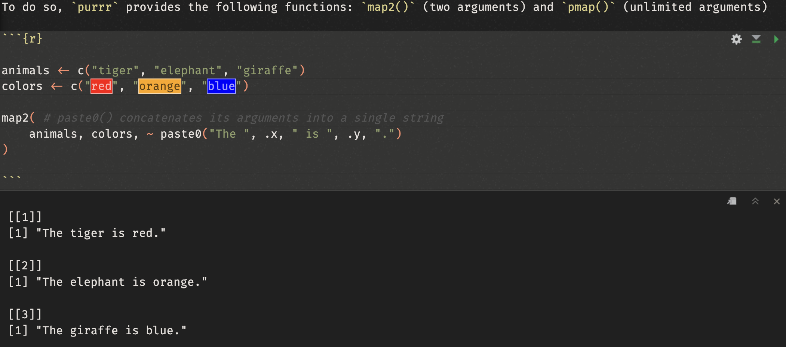

```{r setup, include=FALSE}
options(htmltools.dir.version = FALSE)
library(tidyverse)
library(xaringanExtra)
```

```{r xaringan-themer, include=FALSE, warning=FALSE}
library(xaringanthemer)
style_duo_accent(
  primary_color   = "#000000",
  secondary_color = "#FFFFFF",
  link_color      = "#0645AD",
  header_font_google = google_font("Atkinson Hyperlegible"),
  text_font_google   = google_font("Atkinson Hyperlegible"),
  code_font_google   = google_font("Fira Code"),
  code_inline_background_color = "#e7e8e1",
  text_bold_color = NULL
)
```

```{r xaringan-panelset, echo=FALSE}
xaringanExtra::use_panelset()
```

class: center, middle

# Programming for Professional Research Using R

## Session 4

### November 12, 2025

---

class: middle

## Today

- Learn how to:
    - Create custom functions
    - Use iterative coding in R using:
        - The "for" loop
        - The `across()` function
        - The `map()` function from the `purrr` package
   
- Be introduced to:
    - Communicating process and results using R Markdown

- Practice the above!

---

### Functions in R

What is a function?

A function allows you to efficiently save an operation you may have to use repeatedly, and to run it while only having to modify its inputs, or **arguments**.

I want to rescale the vectors a, b, c, and d so that the smallest value is 0 and the largest value is 1.
Here's how I would do it in R:

```{r, eval = FALSE}
(a-min(a, na.rm = TRUE)) / (max(a, na.rm = TRUE)-min(a, na.rm = TRUE))
(b-min(b, na.rm = TRUE)) / (max(b, na.rm = TRUE)-min(b, na.rm = TRUE))
(c-min(c, na.rm = TRUE)) / (max(c, na.rm = TRUE)-min(c, na.rm = TRUE))
(d-min(d, na.rm = TRUE)) / (max(d, na.rm = TRUE)-min(d, na.rm = TRUE))
```

This is not considered good coding; it requires a lot of copying/pasting, it increases the number of opportunities to make a typo mistake, and it is not efficient.

---

### Functions in R

Solution: custom functions. Custom functions in R are written in the following manner:

```{r, eval = FALSE}
name <- function(arguments) {
  body
}
```

In the case of our reshaping function, it would look like this:

```{r}
# Example for the argument a:
# (a-min(a, na.rm = TRUE)) / (max(a, na.rm = TRUE)-min(a, na.rm = TRUE))

reshape_function <- function(x) {
  (x-min(x,na.rm = TRUE)) / (max(x,na.rm = TRUE)-min(x,na.rm = TRUE))
}
reshape_function(c(-10, 0, 10))
reshape_function(c(1, 2, 3, 4, 5))

```

---

### Iterative Functions in R

What if I want to apply the same function to multiple objects?

What if I wanted to apply `reshape_function`() to 30 variables in my dataset? Rewriting it would be inefficient...

A possible, base R solution: use a "for" loop.

```{r}
for(vector in list(c(-10, 0, 10), c(1, 2, 3, 4, 5))) {
    new_vector <- reshape_function(vector)
    print(new_vector)
}
```

However, the use of "for" loops is discouraged in R because they have to run sequentially through each element of the object. To loop over large objects, this is much slower than alternative options, which directly apply to the whole object.

---

### Iterative Functions in R

A more efficient solution: the function `map()` from the package `purrr`.

```{r}
library(purrr)
purrr::map(
    .x = list(
        c(-10, 0, 10), c(1, 2, 3, 4, 5)
    ),
    .f = reshape_function
)
```

---

### Iterative Functions in R

`map()` has a shorthand to simplify its use: instead of writing the function out, you can replace `function() {}` with `\(argument)` and the function's argument with `argument` ("argument" can be replaced with whatever you want).

.pull-left[
```{r, warning = FALSE}
c(1, 3) %>%
  map(
    function(x) {
        x + 10
    }
  ) %>%
  as.character()
```
]
.pull-right[
```{r, warning = FALSE}
c(1, 3) %>%
  map(
    \(vlu) vlu + 10
  ) %>%
  as.character()
```
]

---

### Iterative Functions in R

We can also apply `map()` to a data frame. If we do so, `map()` will apply the same function to every component of the data frame, i.e. its **columns**. In practice, this is equivalent to applying `map()` to a list of vectors.

```{r, warning = FALSE}
library(palmerpenguins, warn.conflicts = FALSE) # A fun practice dataset about penguins!
data(package = 'palmerpenguins')
# Let's take a glimpse at the dataset:
penguins %>% glimpse()
```

---

### Iterative Functions in R

I want to reshape the numerical variables of the `penguins` dataset. Using `map()`:

```{r}
penguins_reshaped <- penguins %>%
  map(
    \(col) {
      if(is.numeric(col)) {
        reshape_function(col)
      }
      col
    }
  ) %>% as_tibble()
penguins_reshaped %>% glimpse()
```

---

### Iterative Functions in R

The `dplyr` package offers us a function that makes it much easier to modify multiple dataset columns at once: `across()`:

```{r}
penguins_reshaped <- penguins %>%
  mutate(
    across(
      c(bill_length_mm, bill_depth_mm, flipper_length_mm, body_mass_g),
      \(var) reshape_function(var)
    )
  )
penguins_reshaped %>% glimpse()
```

---

`across()` identifies columns by name, or can be combined with `where()` to identify columns by their class. The following are equivalent:

```{r, eval = FALSE}
penguins %>%
  mutate(
    across(
      c(bill_length_mm, bill_depth_mm, flipper_length_mm, body_mass_g, year),
      \(var) reshape_function(var)
    )
  )
penguins %>%
  mutate(
    across(
      matches("length_mm|depth_mm|body_mass|year"),
      \(var) reshape_function(var)
    )
  )
penguins %>%
  mutate(
    across(
      where(is.numeric),
      \(var) reshape_function(var)
    )
  )
```

---

### Iterative Functions in R

Beyond the scope of this class: sometimes we want to iterate functions that have more than one argument.

To do so, `purrr` provides the following functions: `map2()` (two arguments) and `pmap()` (unlimited arguments)

```{r}
animals <- c("tiger", "elephant", "giraffe")
colors <- c("red", "orange", "blue")
map2( # paste0() concatenates its arguments into a single string
    animals, colors, \(anm, clr) paste0("The ", anm, " is ", clr, ".")
)
```

For more on iterative functions, I strongly recommend [this blog post by Rebecca Barter](https://www.rebeccabarter.com/blog/2019-08-19_purrr).

---

### A (Quick) Introduction to R Markdown

RStudio comes with a text and code compiler that allows you to craft narrated scripts, slide decks, blogs, books, and more: R Markdown.

Instead of creating an R Script, you can select "R Markdown" when creating a new document in RStudio.

R Markdown allows you to use the **["markdown" markup language](https://commonmark.org/help/)** to format your text, while include code and outputs using code "chunks":

```{r, echo = FALSE, out.width = "90%", fig.align = "center"}

```

---

class: middle

### A (Quick) Introduction to Quarto

Quarto is a brand new publishing system from the RStudio creators, intended to improve on R Markdown. It allows to combine different coding languages (e.g. both R and Python) into reports, slide decks, websites, etc.

See [https://quarto.org/](https://quarto.org/) for more information.

---

class: center, middle

## Practical Exercise — Using the World Values Survey Dataset

---
<font size='+3'><b>World Values Survey</b></font>

<font size='+2'><b>Background</b></font>
<br> <br>
*"The survey, which started in 1981, seeks to use the most rigorous, high-quality research designs in each country. The WVS consists of nationally representative surveys conducted in almost 100 countries which contain almost 90 percent of the world’s population, using a common questionnaire. [...] WVS seeks to help scientists and policy makers understand changes in the beliefs, values and motivations of people throughout the world."*

<font size='+2'><b>Survey Contents</b></font>
.pull-left[
- Social values, attitudes & stereotypes
- Societal well-being
- Social capital, trust and organizational membership
- Economic values
- Corruption
- Migration
- Post-materialist index
]

.pull-right[
- Science & technology
- Religious values
- Security
- Ethical values & norms
- Political interest and political participation
- Political culture and political regimes
- Demography
]

---

class: middle

### Today's practical component

1. Successfully **fix** the code in the `session_4.R` script.

2. Work on your final assignment! The final assignment is to complete the Session 2, 3, and 4 challenges. You can find the challenges rewritten together on the next slide.
    
**NOTE** — You should refer to documentation for the dataset, which can be found at [https://mfiorina.github.io/sais_r_course/](https://mfiorina.github.io/sais_r_course/)

---

### End of Course Assignment (**Due on Wednesday, April 30**)

.panelset[

.panel[.panel-name[Session 2 Challenge]

Using child_values_country_data, create a scatter plot showing an interesting comparison between two child values across countries.
  
Using child_values_continent_data, create a bar plot comparing a specific child value across continents.
  
Using child_values_continent_data, create a `gt` table showcasing the same data as in your bar plot.

]

.panel[.panel-name[Session 3 Challenge]

Create your own script and do the following:
      
1. Find mean values for 'importance in life' variables (Q1-6) for countries in another region than Europe

2. Calculate average 'enthusiasm' for these life subjects in countries in that non-Europe region
  
3. Perform the same analysis, either on European countries or other countries, for one of the following group of indicators in the dataset:
    - Important child qualities: Q7-17
    - Neighbors: Q18-26
    - Statements to agree with: Q27-41
  
4. Save one dataset for each of the tasks above.

]

.panel[.panel-name[Session 4 Challenge]

CHALLENGE 1 — You are going to use the map() function to rewrite the data importing code below.
Currently, the code loads year-by-year datasets individually and then uses bind_rows() to bring them together. Modify it to use map() and list_rbind() instead.
Remember to use help(...) if you're unsure how a function works.

CHALLENGE 2 — You are going to rewrite the data wrangling section from Session 3, replacing repetitive code with more efficient uses of the across() function.
Hint — Steps 1, 2, and 5 shouldn't be affected. Focus on rewriting Steps 3 and 4 to be more efficient.

]

.panel[.panel-name[Overall]

Final deliverable: a .zip file of the the "<b><span style = "color:red">your name</span></b> R Course Final Assignment" folder. It should have the following:
- An .rproj file in the main folder.

- "code", "data", and "output" folders.

- Three scripts in the "code" folder: `session_2_assignment.R`, `session_3_assignment.R`, and `session_4_assignment.R`. You can use the `session_2.R`, `session_3.R`, and `session_4.R` scripts as foundations for your assignment scripts.

- The requisite data in the "data" folder. You should just need the data from the three sessions, which you should have already downloaded.

- The outputs from your `session_2_assignment.R` script in the "output" folder.

]

]

---

class: middle

# Course Feedback

## [https://forms.gle/TbaSCbqqKAfpjtF59](https://forms.gle/TbaSCbqqKAfpjtF59)

---

## Links

Hadley Wickham, Mine Çetinkaya-Rundel & Garrett Grolemund, **[R for Data Science, 2e — Custom Functions](https://r4ds.hadley.nz/functions)**

Hadley Wickham, **[“dplyr 1.0.0: working across columns”](https://www.tidyverse.org/blog/2020/04/dplyr-1-0-0-colwise/)**

Rebecca Barter, **["Learn to purrr"](https://www.rebeccabarter.com/blog/2019-08-19_purrr)**

RStudio, **[RStudio Cheatsheets](https://www.rstudio.com/resources/cheatsheets/)**

---

## Explore R Further

<ins>**More Complex Data Manipulation**</ins>

Iterative coding (using loops for repetitive code) – purrr ’s map function is your friend. I recommend Thomas Mock, **[“Functional programming in R with Purrr”](https://themockup.blog/posts/2018-12-11-functional-progamming-in-r-with-purrr/)** to get you started.

User-made functions in R – At some point, it will become time-effective to create your own functions to apply to your work. Hadley Wickham, **[Advanced R Chapter 6 – Functions](https://advr.hadley.nz/functions.html)**.

<ins>**Publishing Your R Work**</ins>

RStudio, **[“Introduction to RMarkdown”](https://rmarkdown.rstudio.com/lesson-1.html)**. Summarizes the uses and utility of the RMarkdown framework.

Yihui Xie, **[“xaringan Presentations” – book chapter](https://bookdown.org/yihui/rmarkdown/xaringan.html)** and **[presentation](https://slides.yihui.org/xaringan/)**. Introduction to xaringan , a package
that allows you to create slide decks using R. Also explore the **[xaringanExtra package](https://pkg.garrickadenbuie.com/xaringanExtra/#/)**.

With RMarkdown, create books using **[bookdown](https://bookdown.org/)** or a blog using **[blogdown](https://bookdown.org/yihui/blogdown/)**.

---

## Explore R Further

<ins>**Data Visualization Using Plots**</ins>

The R community organizes **[“Tidy Tuesday”](https://www.tidytuesday.com/)**. This is a weekly challenge where users are provided a dataset and participants then swap graphs and scripts used to create their visualizations.

David Robinson’s **[Tidy Tuesday live screencasts](https://www.youtube.com/user/safe4democracy)** on YouTube. The perfect resource to follow along and try to replicate a professional coder’s scripts.

Yan Holtz and Conor Healy, **[“From Data to Viz”](https://www.data-toviz.com/)**. An amazing repository of methods to create different data visualizations using R.

---

## Explore R Further

<ins>**Geospatial Data Visualization**</ins>

Robin Lovelace, Jakub Nowosad, and Jannes Muenchow, **[Geocomputation with R](https://geocompr.robinlovelace.net/index.html)**. A great introduction to manipulating geospatial data (shapefiles and rasters) in R.

Edzer Pebesma, **[“Simple Features for R”](https://rspatial.github.io/sf/articles/sf1.html)**. An introduction to the sf package, commonly used for geospatial work in R.

Edzer Pebesma, **[“Plotting Simple Features”](https://rspatial.github.io/sf/articles/sf5.html)**. How to use sf and ggplot2 to visualize data using maps.

---

## Explore R Further

For those interested in conducting data work in the development world: Kristoffer Bjarkefur, Luiza Cardoso de Andrade, Benjamin Daniels, and Maria Ruth Jones, **[Development Research in Practice – The DIME Analytics Data Handbook](https://worldbank.github.io/dime-data-handbook/)**. A comprehensive account of tools and instruments to conduct quantitative development research.

For those looking for more hands-on, real-world data work: Ben Baldwin, **[“A beginner’s guide to nflfastR”](https://www.nflfastr.com/articles/beginners_guide.html)**. How to download and explore NFL play-by-play data. This is how I learnt how to use R. Further tutorials using this data can be found at the **[“Open Source Football” blog](https://www.opensourcefootball.com/)**.

