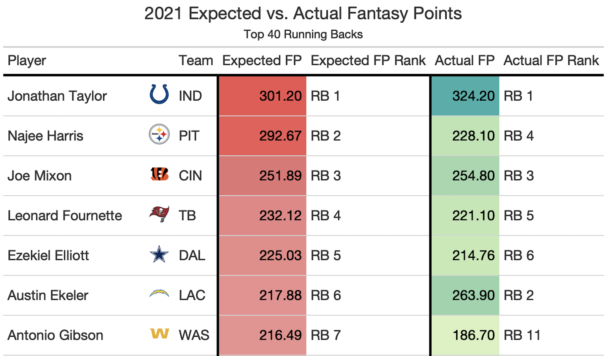
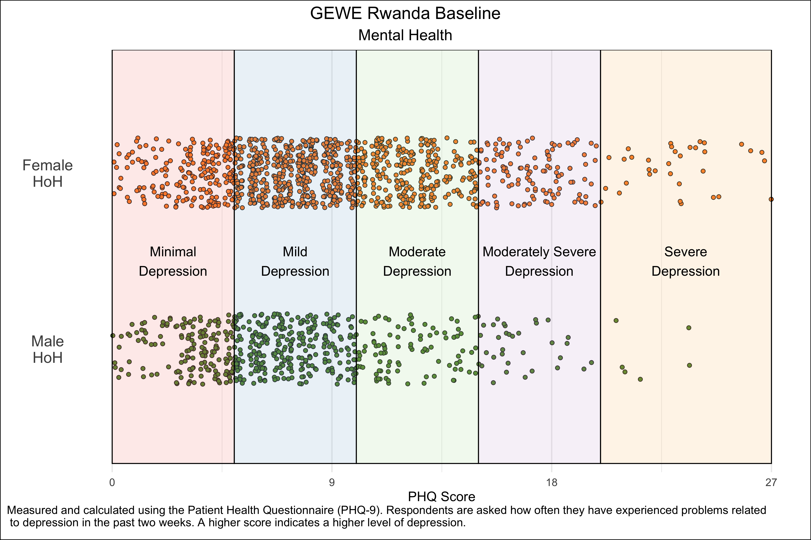

```{r setup, include=FALSE}
options(htmltools.dir.version = FALSE)
library(tidyverse)
library(xaringanExtra)
```

```{r xaringan-themer, include=FALSE, warning=FALSE}
library(xaringanthemer)
style_duo_accent(
  primary_color   = "#000000",
  secondary_color = "#FFFFFF",
  link_color      = "#0645AD",
  text_bold_color = NULL,
  header_font_google = google_font("Atkinson Hyperlegible"),
  text_font_google   = google_font("Atkinson Hyperlegible"),
  code_font_google   = google_font("Fira Mono")
)
```

```{r xaringan-panelset, echo=FALSE}
xaringanExtra::use_panelset()
```

class: center, middle

# Programming for Professional Research Using R

## Session 1

### March 30, 2023

---

## Introduction

.panelset[

.panel[.panel-name[Purpose]

### Purpose of this course: Put you on the right track to use R for professional research.

- **The vast majority** of research assistant/analyst (RA) work consists of cleaning and constructing datasets for analysis

- **Entry-level RA positions rarely require complex econometric/regression skills**

]

.panel[.panel-name[Learning R]

### You should think of learning R like learning a language.

- Taking a six-hour course won't make you proficient in it

- If you don't practice it, you'll forget it

- Solution -- **Find ways to use R in your life, either personally or professionally**

]

]

---

## Why R?

.panelset[

.panel[.panel-name[Jobs]

<br>
<br>
<br>
<br>
- Many entry-level research jobs in policy, economic, development, or political science institutions now expect quantitative work using Stata, R, or Python

- Coding skills make you more valuable in any position -- data adds value to nearly every kind of research!

]

.panel[.panel-name[Beautiful Tables]

```{r, echo = FALSE, out.width = "100%", fig.align = "center"}


```

]

.panel[.panel-name[Beautiful Graphs]

```{r, echo = FALSE, out.width = "85%", fig.align = "center"}


```

]

.panel[.panel-name[Beautiful Maps]

```{r, echo = FALSE, out.width = "75%", fig.align = "center"}

knitr::include_graphics(
  
    "pics/map_example.png"
  
)
```

]

]

---

class: middle

## Today

- Learn how to:
  - Import data in an efficient and reproducible manner
  - Filter, mutate, group, and summarize data using Tidyverse functions
  - Reshape data using Tidyverse functions
      
- Be introduced to:
  - Code and data collaboration -- GitHub and data project reproducibility

- Practice the above!

---

## R Basics

.panelset[

.panel[.panel-name[RStudio Layout]

- You write your code in a **script**

- When you run the code, it runs in the **console**

- The objects that you use/create (datasets, vectors, values) appear in your **environment**

]

.panel[.panel-name[Creating Vectors]

```{r}
vector <- c(1, 2, 5)
vector
```

```{r}
vector <- 2:6
vector
```

```{r}
vector <- seq(2, 3, by = 0.5)
vector
```

]

.panel[.panel-name[Selecting Vector Elements]

```{r eval = FALSE}
## By Position

x[4]       # Fourth element

x[-4]      # Everything but the fourth element

x[2:4]     # Elements two to four

x[-(2:4)]  # Everything but elements two to four

x[c(1, 5)] # Elements one and five
```

```{r eval = FALSE}
# By Value

x[x == 10]           # Elements which are equal to 10

x[x < 0]             # Elements that are less than zero

x[x %in% c(1, 2, 5)] # Elements in the set 1, 2, 5
```

]
  
]

---

class: center, middle

# Coding Set Up

---

.panelset[

.panel[.panel-name[Installing Packages]

### Easy

```{r eval = FALSE}
install.packages("tidyverse")

library(tidyverse)
```

### Better

The `pacman` package installs packages if they aren't installed yet, loads them otherwise

```{r eval = FALSE}
if(!require(pacman)) install.packages("pacman")

pacman::p_load(tidyverse)
```

]

.panel[.panel-name[Setting up File Paths]

You want your code to be **reproducible** and **easy to use by other people**

Solution:

```{r eval = FALSE}
# Set User (this allows us to use fixed file paths but to adapt them
# for multiple possible users)
  
      # 1 -- Marc-Andrea Fiorina
  
      # 2 -- Enter here if needed
  
user <- 1
  
if(user == 1) {
    
    # Absolute file path
      
    main_filepath <- "/Users/marc-andreafiorina/Dropbox/SAIS R Course/"
      
}

# Notice the relative file paths

data_filepath <- paste0(main_filepath, "data/")
```

]

]

---

class: center, middle

# Importing Data

---

class: middle

Easiest file type to import into R is a .csv file. But you can also import .xlsx, .dta (Stata), etc.

- Easy `->` `read.csv()`
- Harder (faster) `->` `data.table::fread()`

```{r eval = FALSE}
norms_values_data <- data.table::fread(
    paste0(data_filepath, "session_1/wvs_values_norms_data.csv"),
    na.strings = ""
      
)
```

---

class: center, middle

# Data 'Wrangling'

---

## Tidyverse Introduction

.panelset[

.panel[.panel-name[Base R Layout]

```{r}
names(mtcars)
```

```{r}
str_replace(str_to_upper(names(mtcars)), "MPG", "HELLO")
```

]

.panel[.panel-name[Tidyverse Layout]

Tidyverse functions introduce a 'cleaner' method to write code out, using what is called the 'pipe operator': **`%>%`**. It's almost like writing a recipe, step by step.

```{r}
names(mtcars)
```

```{r}
mtcars %>%
    names() %>%
    str_to_upper() %>%
    str_replace("MPG", "HELLO")
```

]

]

---

.panelset[

.panel[.panel-name[mutate()]

```{r}
mutate_example <- mtcars %>%
    mutate(
        heavy = case_when(
            wt > 3 ~ "Yes",
            TRUE   ~ "No"
        )
    ) %>%
    select(wt, heavy)

mutate_example %>% head()
```

]

.panel[.panel-name[filter()]

```{r}
filter_example <- mtcars %>%
    filter(wt > 3)

filter_example %>% head()
```

]

.panel[.panel-name[select()]

```{r}
select_example <- mtcars %>%
    select(
        matches("mpg|carb")
    )
select_example %>% head()
```

]

]

---

.panelset[

.panel[.panel-name[group_by() and summarize()]

```{r}
group_by_summarize_example <- mtcars %>%
    group_by(cyl) %>%
    summarize(
        mpg = mean(mpg, na.rm = TRUE)
    )

group_by_summarize_example
```

]

.panel[.panel-name[pivot_longer()]

```{r}
relig_income[1:6] %>% head(n = 2)

relig_income_long <- relig_income %>%
    pivot_longer(
        cols      = !religion, # Everything but religion
        names_to  = "levels",
        values_to = "num"
    )

relig_income_long %>% head(n = 4)
```

]

.panel[.panel-name[pivot_wider()]

```{r}
fish_encounters %>% head(n = 4)

fish_encounters_wide <- fish_encounters %>%
    pivot_wider(
        names_from  = station,
        values_from = seen
    )

fish_encounters_wide[1:6] %>% head(n = 2)
```

]

]

---

class: center, middle

# Code and Data Collaboration

## Important Points

---

class: middle

## Professional settings are collaborative settings

Most R courses teach you to code in isolation. But **professional use of R often happens within teams of researchers**.

Reproducibility and shareability of your code are key to ensure:
- Others can use and understand your work
- Accountability

---

## The ultimate collaborative tool: GitHub

GitHub is the preferred code storing platform for data teams because of the following attributes:
- **Easy sharing** of scripts between team members
- **Tracked changes** -- every changed line of code is attributed to a specific person
- **'Commit' structure** -- allows you to see how your changes affect other people's work on the same scripts

```{r, echo = FALSE, out.width = "75%", fig.align = "center"}

knitr::include_graphics(
  
    "pics/github_example.png"
  
)
```

---

## Practical Exercise -- Using the World Values Survey Dataset

---
<font size='+3'><b>World Values Survey</b></font>

<font size='+2'><b>Background</b></font>
<br> <br>
*"The survey, which started in 1981, seeks to use the most rigorous, high-quality research designs in each country. The WVS consists of nationally representative surveys conducted in almost 100 countries which contain almost 90 percent of the world’s population, using a common questionnaire. [...] WVS seeks to help scientists and policy makers understand changes in the beliefs, values and motivations of people throughout the world."*

<font size='+2'><b>Survey Contents</b></font>
.pull-left[
- Social values, attitudes & stereotypes
- Societal well-being
- Social capital, trust and organizational membership
- Economic values
- Corruption
- Migration
- Post-materialist index
]

.pull-right[
- Science & technology
- Religious values
- Security
- Ethical values & norms
- Political interest and political participation
- Political culture and political regimes
- Demography
]

---

class: middle

### Today's practical component

1. Successfully run the code in the `session_1_template.R` script

2. Create your own script and do one or more of the following:
  
    - Find mean values for 'importance in life' variables (Q1-6) for countries in another region than Europe
  
    - Calculate average 'enthusiasm' for these life subjects in countries in another region than Europe
  
    - Perform the same analysis, either on European countries or other countries, for another group of indicators in the dataset:
        - Important child qualities: Q7-18
        - Neighbors: Q19-26
        - Statements to agree with: Q27-41
    
**NOTE** You should refer to documentation for the dataset, which can be found in `Dropbox/SAIS R Course/documentation/`, for details on the variables and their given values.

---

## Links

Syllabus: **https://mfiorina.github.io/sais_r_course/syllabus/r_course_syllabus.html**

Thomas Mock, “A Gentle Introduction to Tidy Statistics in R” (**[blog post](https://themockup.blog/posts/2018-12-10-a-gentle-guide-to-tidy-statistics-in-r/)** and **[video](https://www.rstudio.com/resources/webinars/a-gentle-introduction-to-tidy-statistics-in-r/)**)

Dominic Royé, **[“A very short introduction to Tidyverse”](https://dominicroye.github.io/en/2020/a-very-short-introduction-to-tidyverse/)**

tidyr, **[“Pivoting”](https://tidyr.tidyverse.org/articles/pivot.html)**

Hadley Wickham, **[“dplyr 1.0.0: working across columns”](https://www.tidyverse.org/blog/2020/04/dplyr-1-0-0-colwise/)**

Hadley Wickham & Garrett Grolemund, **[R for Data Science](https://r4ds.had.co.nz/)**

RStudio, **[RStudio Cheatsheets](https://www.rstudio.com/resources/cheatsheets/)**

