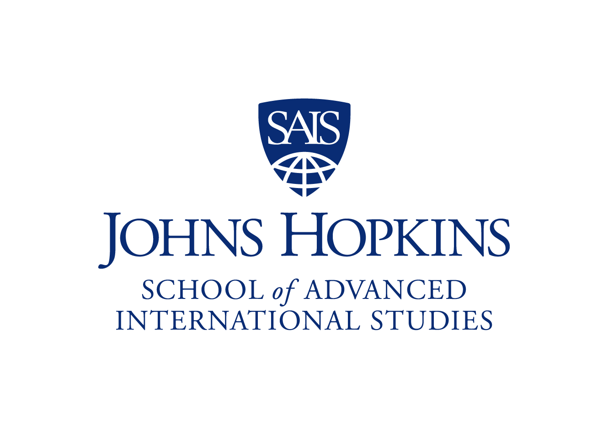

```{r setup, include=FALSE}
knitr::opts_chunk$set(echo = TRUE)
```

<div style="text-align: right"><font size = -1>For a PDF version of this document, please click [here](https://mfiorina.github.io/sais_r_course/syllabus/r_course_syllabus.pdf).</font></div>

```{r, echo = FALSE, out.width = "50%", fig.align = "center"}
 

```

<center>
### Professional Skills Course
### Syllabus — Fall 2025

# Programming for Professional Research Using R

## Marc-Andrea Fiorina
Contact: mfiorin2@jhu.edu
</center>

---

### The course slides, syllabus, and other resources are available at the following link: https://mfiorina.github.io/sais_r_course/.

---

## Schedule
<br>
<center>
| Weekday   | Date              | Room          | Start Time | End Time |
|:---------:|:-----------------:|:-------------:|:----------:|:--------:|
| Wednesday | October 22, 2025  | 555 Penn, 432 | 6:00pm     | 8:00pm   |
| Wednesday | October 29, 2025  | 555 Penn, 432 | 6:00pm     | 8:00pm   |
| Wednesday | November 5, 2025  | 555 Penn, 432 | 6:00pm     | 8:00pm   |
| Wednesday | November 12, 2025 | 555 Penn, 432 | 6:00pm     | 8:00pm   |
</center>

---

## Course Description

Entry-level research and analysis positions in universities, government offices and contractors, think tanks, and multilateral institutions are increasingly expected to perform basic quantitative tasks using statistical software such as Stata, R, or Python. As data work has become near-ubiquitous in the policy world, so have basic tasks like aggregating, analyzing, summarizing, and visualizing data.

This course introduces you to statistical analysis programming using the R language. R is an open-source, statistical programming language used widely across a number of industries. This course will also aim to provide you with the foundation to continue to develop your knowledge and experience of R beyond its duration.

---

## Course Objectives

By the end of this course, students will be able to set up their own R environment and feel comfortable using R for simple data tasks in coursework, internships, or entry-level research/data positions. They will have the foundation to continue to learn by practicing R beyond this course.

In more detail, students will be introduced to the use of:

- `dplyr`'s `select()` and `mutate()` functions to explore and modify datasets;
- `dplyr`'s `group_by()` and `summarize()` functions to generate summary statistics;
- `tidyr`'s `pivot_longer()` and `pivot_wider()` functions to reshape data for easier analysis;
- `purrr`'s `map()` and `dplyr`'s `across()` functions to perform iterative coding;
- The `gt` and `stargazer` packages to generate HTML, PNG, or LateX summary tables;
- The `ggplot2` package to generate descriptive scatter plots of data.

---

## Course Outline

<br>
<center>
| Session | Description |
| ------- | ----------- |
| **I — Setting Up Your R Environment** | - Introduction to Coding — Learn how to think as a coder, how to identify the basic components of data analysis<br>- Introduction to the RStudio Interface — Learn how to set up your environment to use R and RStudio<br>- Troubleshooting R — How to identify and address basic errors in your R setup |
| **II — Visualization** | - Creating Plots and Graphs — Learn how to create scatter and bar plots using `ggplot2` <br>- Creating HTML and PDF Tables — Learn how to create shareable tables using `gt` |
| **III — Transformation** | - The Building Blocks of R — Explore scalars, vectors, lists, and tibbles in R <br>- The Basic Verbs of R — Learn how to use `mutate()`, `select()`, `filter()`, `group_by()`, and `summarize()` <br>- Tidy Data — Introduction to tidy datasets, `pivot_longer()`, and `pivot_wider()` |
| **IV — Programming and Communication** | - Programming in R — Learn about functions and iteration using `map` and `across` in R |
</center>

---

## Course Structure

Each two-hour session will be split into two halves. The first half (approx. one hour) will consist of an interactive lecture using slides and live coding. The second half (approx. one hour) will consist of practical exercises that the students will accomplish with my support.

The last two sessions will begin with multiple-choice questionnaires on the topic of the previous week's content. At the end of the course, there will be an open-ended assignment in which the students will have the option to create a script, which I will then review and provide feedback.

---

## Course Readings/Resources

As there will be no time for this in class, **YOU NEED TO DO THE FOLLOWING BEFORE THE FIRST SESSION:**

- Download R at this link: https://cran.r-project.org/
  - Windows users, click on 'Download R for Windows' and then download the 'base' version. The file should be called `R-4.5.1-win.exe`.
  - Mac users, click on 'Download R for MacOS' and then download the file called:
      - `R-4.5.1-arm64.pkg` if you have a more recent MacBook with an M1,2... chip.
      - `R-4.5.1.pkg` if you have an older MacBook with an Intel chip.
  
- Download RStudio at this link: https://posit.co/download/rstudio-desktop/. Download 'RStudio Desktop'.

<br><br>

**Note** — Readings and resources below are optional and are provided for context and use after the course is finished. The session slides will cover everything needed for the course.

<br>

### Overall Readings and Resources

- Hadley Wickham, Mine Çetinkaya-Rundel & Garrett Grolemund, [*R for Data Science (2e)*](https://r4ds.hadley.nz/). This is the foundational textbook for use of the "Tidyverse" package suite in R.

- RStudio, [RStudio Cheatsheets](https://www.rstudio.com/resources/cheatsheets/). Cheatsheets to help perform basic data tasks in R.

- Thomas Mock's [The Mockup Blog](https://themockup.blog/) has a great array of tutorials for all levels. You'll see posts from there below.

- [The World Bank DIME Wiki](https://dimewiki.worldbank.org/Main_Page). A wiki with open-source articles on how to be a research assistant with the World Bank. Great insights into collaborative data work, reproducibility, and the responsibilities of an entry-level data researcher.

<br>

### Session 1 — Introduction to R

- For those who are fully new to R, I strongly recommend: Thomas Mock, "A Gentle Introduction to Tidy Statistics in R" — [blog post](https://themockup.blog/posts/2018-12-10-a-gentle-guide-to-tidy-statistics-in-r/) and [video](https://www.rstudio.com/resources/webinars/a-gentle-introduction-to-tidy-statistics-in-r/). We won't have much time to review the basics of R programming during the first session.

<br>

### Session 2 — Visualization
<ins>Plots</ins>
- Alicia Horsch, [“A quick introduction to ggplot2”](https://towardsdatascience.com/a-quick-introduction-to-ggplot2-d406f83bb9c9). Introduction to the ggplot2 package, the main instrument for plot creation in R.

<ins>Tables</ins>
- Thomas Mock, [“gt - a (G)rammar of (T)ables”](https://themockup.blog/posts/2020-05-16-gt-a-grammer-of-tables/). Introduction to the gt package, a more flexible instrument to export tables in PNG, PDF, or HTML formats.

- Marek Hlavac, [“stargazer: beautiful LATEX, HTML and ASCII tables from R statistical output”](https://cran.r-project.org/web/packages/stargazer/vignettes/stargazer.pdf). Vignette for the stargazer package, main tool to export regression tables to LateX

<br>

### Session 3 — Transformation

- Dominic Royé, [“A very short introduction to Tidyverse”](https://dominicroye.github.io/en/2020/a-very-short-introduction-to-tidyverse/). Blog post covering the basics of Tidyverse use in R.

- Wickham, Çetinkaya-Rundel & Grolemund, [R for Data Science (2e) Chapter 5 — Data Tidying](https://r4ds.hadley.nz/data-tidy.html#sec-tidy-data). How to structure (“tidy”) your dataset for flexible use in data analysis.

- tidyr, [“Pivoting”](https://tidyr.tidyverse.org/articles/pivot.html). Vignette explaining how to reshape datasets using pivot_longer and pivot_wider.

<br>

### Session 4 — Iterative Coding

- Rebecca Barter, [“Learn to purrr”](https://www.rebeccabarter.com/blog/2019-08-19_purrr). Blog post covering the basics of using iterative functions with the purrr package in R.

- Hadley Wickham, [“dplyr 1.0.0: working across columns”](https://www.tidyverse.org/blog/2020/04/dplyr-1-0-0-colwise/). Explains the basics for flexible column-wise operations using across in R.

<br>

### Further Resources

- We won't have time to explore more advanced data manipulation techniques. Here are some resources for those who are interested in learning on their own:
  - User-made functions in R — At some point, it will become time-effective to create your own functions to apply to your work. [Hadley Wickham, *Advanced R* Chapter 6 — Functions](https://adv-r.hadley.nz/functions.html).
  
<br>
  
- For those interested in learning more about publishing your work using RMarkdown:
  - RStudio, ["Introduction to RMarkdown"](https://rmarkdown.rstudio.com/lesson-1.html). Summarizes the uses and utility of the RMarkdown framework.
  - Yihui Xie, "xaringan Presentations" — [book chapter](https://bookdown.org/yihui/rmarkdown/xaringan.html) and [presentation](https://slides.yihui.org/xaringan/). Introduction to `xaringan`, a package that allows you to create slide decks using R. Also explore the [`xaringanExtra` package](https://pkg.garrickadenbuie.com/xaringanExtra/#/).
  - With RMarkdown, create books using [`bookdown`](https://bookdown.org/) or a blog using [`blogdown`](https://bookdown.org/yihui/blogdown/)
  
<br>
  
- For those interested in data visualization:
  - The R community organizes ["Tidy Tuesday"](https://www.tidytuesday.com/). This is a weekly challenge where users are provided a dataset and participants then swap graphs and scripts used to create their visualizations.
  - David Robinson's [Tidy Tuesday live screencasts](https://www.youtube.com/user/safe4democracy) on YouTube. The perfect resource to follow along and try to replicate a professional coder's scripts.
  - Yan Holtz and Conor Healy, ["From Data to Viz"](https://www.data-to-viz.com/). An amazing repository of methods to create different data visualizations using R. 
  
<br>
  
- For those interested in geospatial work and visualizations using maps:
  - Robin Lovelace, Jakub Nowosad, and Jannes Muenchow, [*Geocomputation with R*](https://geocompr.robinlovelace.net/index.html). A great introduction to manipulating geospatial data (shapefiles and rasters) in R.
  - Edzer Pebesma, ["Simple Features for R"](https://r-spatial.github.io/sf/articles/sf1.html). An introduction to the `sf` package, commonly used for geospatial work in R.
  - Edzer Pebesma, ["Plotting Simple Features"](https://r-spatial.github.io/sf/articles/sf5.html). How to use `sf` and `ggplot2` to visualize data using maps.
  
<br>
  
- For those interested in conducting data work in the development world: Kristoffer Bjarkefur, Luiza Cardoso de Andrade, Benjamin Daniels, and Maria Ruth Jones, [*Development Research in Practice — The DIME Analytics Data Handbook*](https://worldbank.github.io/dime-data-handbook/). A comprehensive account of tools and instruments to conduct quantitative development research.

- For those looking for more hands-on, real-world data work: Ben Baldwin, ["A beginner's guide to nflfastR"](https://www.nflfastr.com/articles/beginners_guide.html). How to download and explore NFL play-by-play data. This is how I learnt how to use R. Further tutorials using this data can be found at the ["Open Source Football" blog](https://www.opensourcefootball.com/).

---

## Instructor Biography

My name is Marc-Andrea Fiorina, and I am a research analyst at OpenResearch. Over the past six years, I worked as an intern, research assistant, and analyst using R for impact evaluations and economic research programs with Development Impact (DIME) at the World Bank. I hold a Bachelor of Arts (Hons.) in Philosophy, Politics, and Economics from the University of Oxford (2017) and a Master of Arts in International Politics and Economics (Bologna 2018, DC 2019) from Johns Hopkins University SAIS.

As a research assistant, I learnt how to work with data in a collaborative space and how to improve my coding language learning through continuous use and good practices. I hope to share those practices and resources with you through this course.

